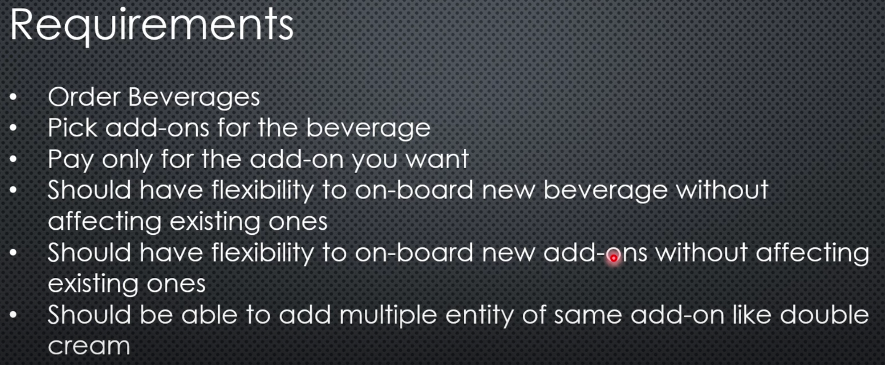
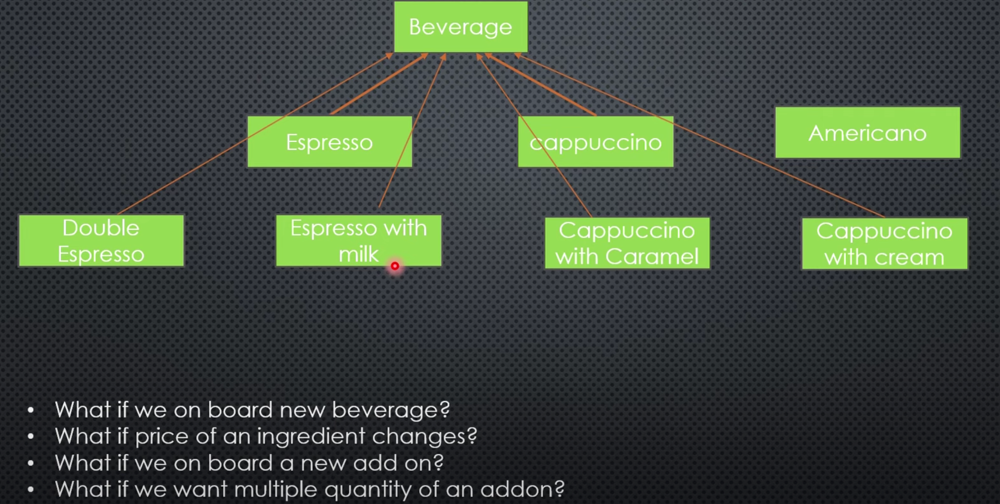
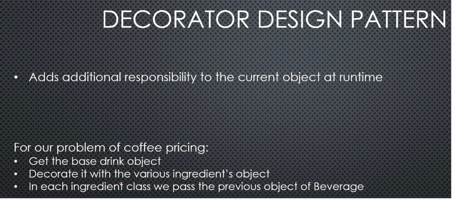

# Practiced_Problems

Coding problems practice solutions

# Design Patterns

For Simple Factory design pattern

Requirements for Design pattern (Data Ingestion Framework)

For Factory Method Design Pattern

Desgin Flow for Factory Method Design Pattern

=================================

Decorator Design Pattern

Low Level Design (Starbucks | Coffee House System Design)

Issue with the Simple Design:

=================================

Adapter Design Pattern

Low Level Design (System Design Media player | Object Oriented Programming)

=================================
